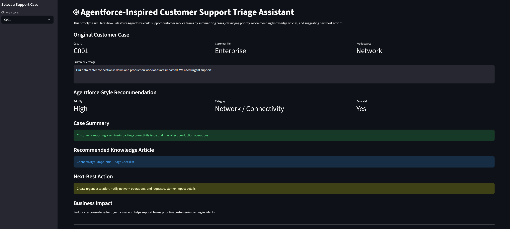

# Agentforce-Inspired Customer Support Triage Assistant

## Overview

This is a  prototype inspired by Salesforce Agentforce for customer support automation. The app simulates how an AI support assistant could help customer service teams summarize support cases, classify priority, recommend knowledge articles, suggest next-best actions, and identify escalation needs.

The goal of this project is to demonstrate how AI and workflow automation can improve case management, reduce manual triage effort, and support faster customer response.

This project shows how I approach business problems by quickly converting a job-relevant use case into a working prototype.

## Features

- Support case summarization
- Priority classification
- Issue category classification
- Knowledge article recommendation
- Next-best action recommendation
- Escalation recommendation
- Business impact explanation
- Streamlit-based interactive demo

## Demo Screenshot



## Tech Stack

- Python
- Streamlit
- pandas
- Rule-based AI workflow simulation

## Project Workflow

Customer Case  
→ Case Summary  
→ Category Classification  
→ Priority Classification  
→ Knowledge Article Recommendation  
→ Next-Best Action  
→ Escalation Decision  

## Example Use Case

A customer reports that their data center connection is down and production workloads are impacted.

The assistant identifies the case as:

- Priority: High
- Category: Network / Connectivity
- Escalation: Yes
- Recommended action: Create urgent escalation, notify network operations, and request customer impact details.

## Business Value

This type of workflow can help support teams:

- Reduce manual case review time
- Improve consistency in triage decisions
- Route urgent cases faster
- Recommend relevant knowledge articles
- Support customer service leaders in identifying automation opportunities

## Future Improvements

- Connect to Salesforce case data
- Use Agentforce or LLM based prompts for dynamic reasoning
- Add real knowledge base retrieval
- Track support KPIs such as resolution time, escalation rate, and case priority accuracy
- Add stakeholder feedback loop to improve recommendation quality

## How to Run

```bash
pip install -r requirements.txt
streamlit run app.py
